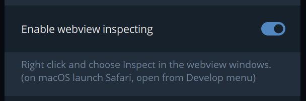
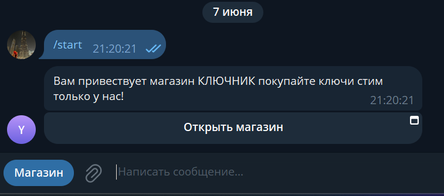
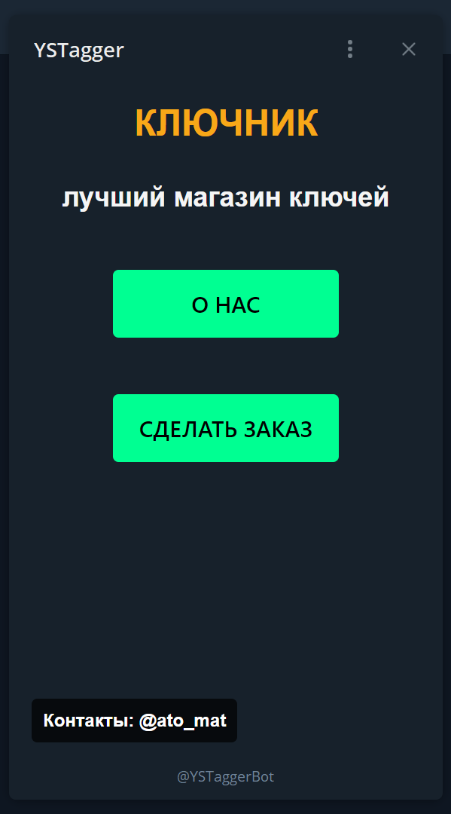
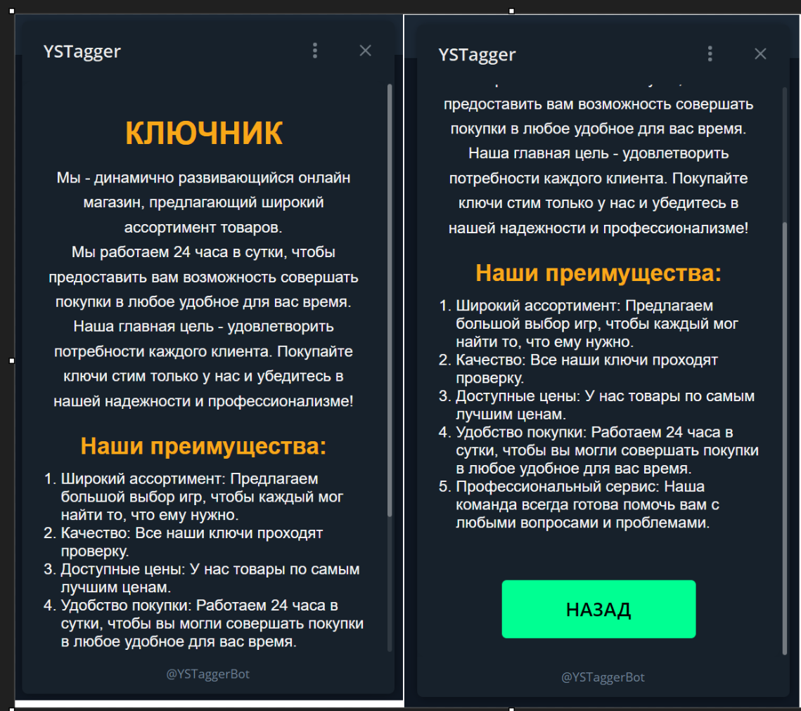
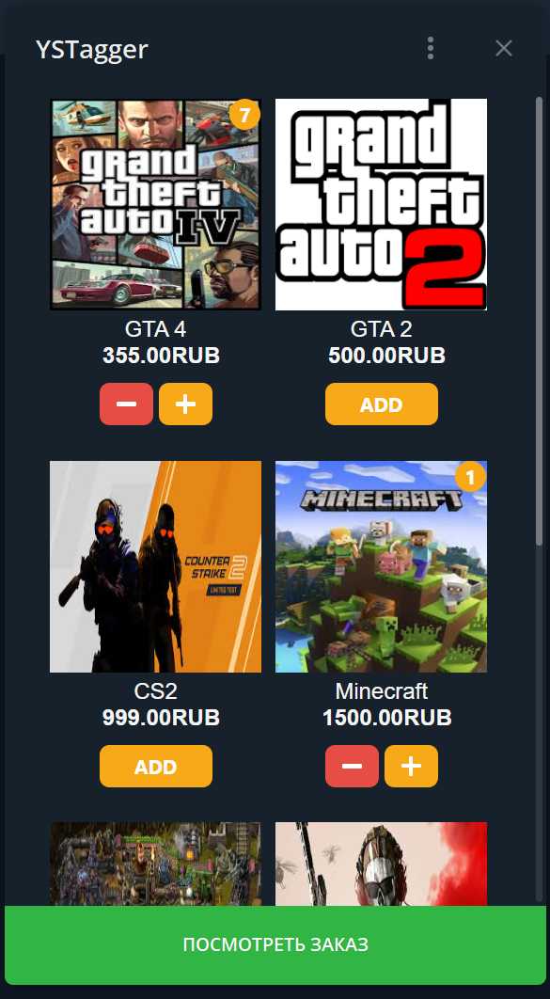
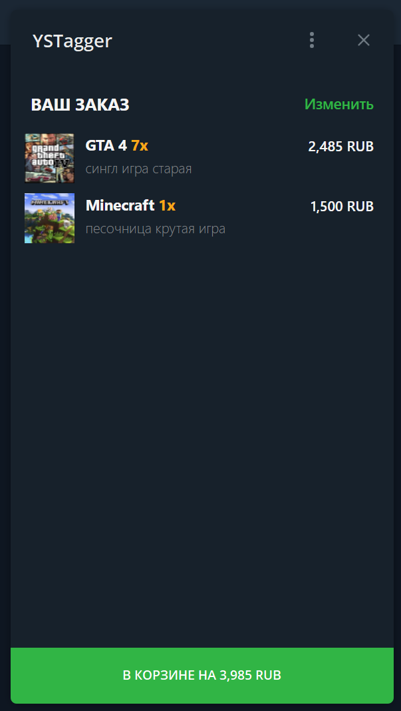
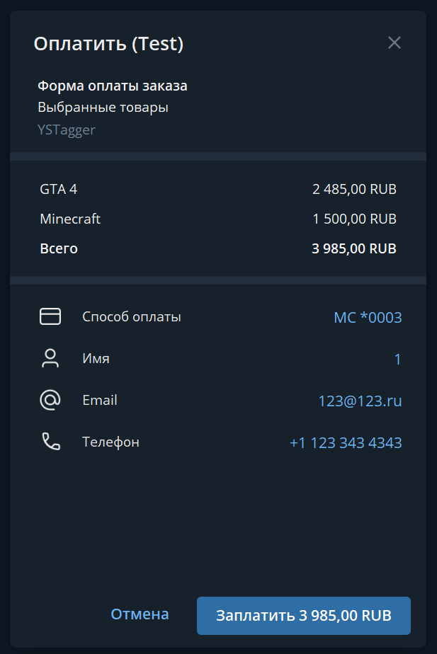
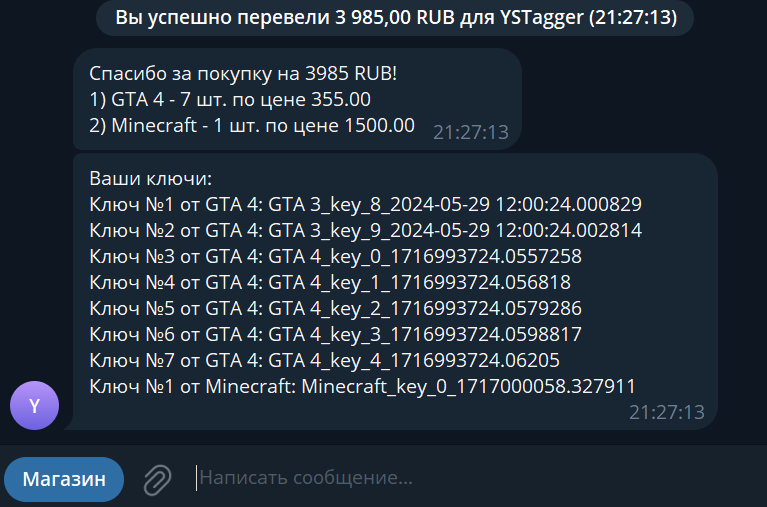

## Shopbot

Django проект, цель которого - создать Telegram бота с webapp приложением.  
Суть приложения - покупка чего-либо из приложения Telegram внутри webapp.  


## Webapp
Webapp - он же mini apps - они же приложения в Telegram  
По факту webapp - открытие сайта внутри тг с фишками тг  


## Легенда
Существует оффлайн магазин "Ключник", который торгует Steam ключами от игр.  
Магазин решил создать приложение внутри телеграма, чтобы пользователю не нужно было переходить на его сайт.  


## Запуск
1) Получить https сертификат на ваш сервер Ex: [certbot](https://certbot.eff.org)
2) Создать файл .env и заполнить его по образцу .env.example
    - необязательно указывать DEBUG, MAIN_PAGE_URL. TELEGRAM_API_URL, DJANGO_SECRET_KEY
3) Поднять nginx. Мой конфиг, заменить {SERVER_NAME} на свои данные:
```
server {
        server_name {SERVER_NAME} www.{SERVER_NAME};
        location / {
                proxy_pass http://localhost:8000;
                proxy_set_header Host $http_host;
                proxy_set_header X-Real-IP $remote_addr;
                proxy_set_header X-Forwarded-For $proxy_add_x_forwarded_for;
                proxy_set_header X-Forwarded-Proto $scheme;
                # proxy_set_header X-Forwarded-Host $server_name;
                proxy_set_header X-Forwarded-Host $host;
                proxy_set_header X-Forwarded-Server $host;
        }
    listen [::]:443 ssl ipv6only=on; # managed by Certbot
    listen 443 ssl; # managed by Certbot
    ssl_certificate /etc/letsencrypt/live/{SERVER_NAME}/fullchain.pem; # managed by Certbot
    ssl_certificate_key /etc/letsencrypt/live/{SERVER_NAME}/privkey.pem; # managed by Certbot
    include /etc/letsencrypt/options-ssl-nginx.conf; # managed by Certbot
    ssl_dhparam /etc/letsencrypt/ssl-dhparams.pem; # managed by Certbot
}
server {
    if ($host = www.{SERVER_NAME}) {
        return 301 https://$host$request_uri;
    } # managed by Certbot
    if ($host = {SERVER_NAME}) {
        return 301 https://$host$request_uri;
    } # managed by Certbot
        listen 80;
        listen [::]:80;
        server_name {SERVER_NAME} www.{SERVER_NAME};
    return 404; # managed by Certbot
}
```
4) Запустить тг бота и django сервер командой
 `./start.sh`
5) должен заработать тг бот 


## Структура


### Django проект:
- приложение shopbot - основное приложение с настройками для django проекта
- приложение bot - приложение для работы с telegram ботом
- приложение webapp - приложение для работы с webapp


### Приложение bot:
- содержит команду start_telegram_bot, которая запускает telegram бота
- файл telegram_bot, в котором находятся все хендлеры бота
- файл views, в котором находится django view для создания ссылки оплаты


### Приложение webapp: 
- команда generate_product_keys - генерация 10 ключей для всех игр 
- команда update_remain_keys - обновление остатка ключей для игр
- статику и шаблон (html, js, css) для webapp 
- модели:
    - ShopProduct - сама игра с ее описанием
    - ShopProductKey - ключи ко всем играм
    - ShopOrder - успешные сделки с пользователями


## Важное

Чтобы видеть какие то игры в разделе "Сделать заказ"  
нужно вручную добавить сами игры в модель django  
для этого нужно зайти по ссылке `https://{your_website}/admin`  
перейти в модель ShopProduct и добавить полей с играми

команда `python manage.py generate_product_keys`   
добавит к каждой игре по 10 ключей для тестов


команда `python manage.py update_remain_keys`   
автоматически обновит поля оставшихся ключей в модели игр

команда `python manage.py start_telegram_bot`   
запустит телеграм бота

команда запуска `./start.sh` может некорректно отработать при  
завершении работы, поэтому возможно придется вручную килять   
процессы для повторного запуска


## Интересное

Для дебага вашего webapp можно включить настройку в телеграме
Будет открываться devtools как в браузере по пкм 
Очень полезна при разработке 




## Картиночки 














## TODO

- [ ] docker
- [ ] optimize js code
- [ ] improve layout 
- [ ] normal start script

## THX

https://github.com/telegram-bot-php/durger-king    
https://github.com/fruitourist/liot/tree/main   
