# ShopBot

**Shopbot - маркетплейс цифровых ключей для игр.**
Несколько магазинов, у каждого свои товары; витрина открывается как WebApp внутри
Telegram, оплата — **Telegram Stars**, купленные ключи бот присылает в чат.


---

## Возможности

- **Маркетплейс**: несколько магазинов, у каждого владелец и сотрудники.
- **Витрина (WebApp)**: каталог с поиском, фильтром по категориям и бесконечной
  подгрузкой, страница товара, корзина (на сессии), история заказов, профиль.
- **Оплата Telegram Stars**: `createInvoiceLink` (`currency=XTR`), выдача ключей и
  уведомление владельцев магазина в `successful_payment`, возврат звёзд (`refundStarPayment`).
- **Авторизация** через `initData` из Telegram WebApp (HMAC-SHA256).
- **Своя админ-панель** (`/panel/`, Bootstrap 5): дашборд с графиками, CRUD товаров и
  ключей, заказы, магазины, пользователи. Разграничение доступа: супер-админ / владелец / сотрудник.
- **Поддержка (тикеты)**: пользователь создаёт обращения в WebApp, они улетают в чат
  поддержки (`SUPPORT_CHAT_ID`) с кнопкой «Ответить»; ответ из чата приходит пользователю в бот.

---

## Технологии

Django 5 · Django REST Framework · aiogram 3 ·
PostgreSQL 16 · Bootstrap 5 + Chart.js · Pillow · gunicorn ·
Docker / docker-compose · nginx + Let's Encrypt.

---

## Структура

```
shopbot/                      # Django-проект (manage.py здесь)
├── shopbot/settings/         # base / development / production (выбор по DJANGO_ENV)
├── webapp/                   # витрина + ВСЕ модели + DRF API + Telegram-auth
│   ├── models.py             # Модели
│   ├── views.py              # HTML-вьюхи
│   ├── api.py                # auth, корзина, инвойс, возврат
│   └── management/commands/  # вспомогательные команды
├── panel/                    # админ-панель
└── bot/                      # Telegram-бот (aiogram): /start, оплата, уведомления
```

---

## Модели

- **TelegramUser** (`AbstractUser`): `telegram_id` (NOT NULL, unique), `telegram_username`, `avatar_url`.
- **Shop** + **ShopMembership** (роль owner/staff) — пользователь может состоять в нескольких магазинах.
- **Category** (дерево через self-FK), **Product** (`price_stars`, `stock`/`in_stock` — property).
- **ProductKey** (`is_sold`, `order_item`), **Order** (`status`, `telegram_payment_charge_id`),
  **OrderItem** (`shop` денормализован для статистики, `delivered_keys` JSON).
- **SupportTicket** (`subject`, `status`) + **SupportMessage** (`is_staff`, append-only) — обращения в поддержку.

---

## Поток оплаты (Telegram Stars)

1. Витрина собирает session-корзину → `POST /api/create-invoice/`.
2. Сервер проверяет наличие ключей и дёргает `createInvoiceLink`: `currency="XTR"`,
   `provider_token=""`, сумма — целое число звёзд (без деления на 100). `payload` — состав заказа.
3. Фронт открывает счёт через `Telegram.WebApp.openInvoice(link)`.
4. Бот: `pre_checkout_query` проверяет ключи → `successful_payment` создаёт `Order`+`OrderItem`,
   резервирует ключи (`select_for_update`), сохраняет `telegram_payment_charge_id`,
   шлёт ключи покупателю и уведомляет владельцев магазина.
5. Возврат: `POST /api/orders/<pk>/refund/` → `refundStarPayment`, ключи возвращаются в наличие.

---

## Поддержка (тикеты)

1. Пользователь пишет обращение в WebApp (**Профиль → «Поддержка»**, `/support/`). Сохраняется
   `SupportTicket` + `SupportMessage` (старые сообщения не редактируются, можно только дополнять).
2. Бот шлёт обращение в чат `SUPPORT_CHAT_ID`: тема (≤500 симв.), статус и кнопка **«Ответить»**.
3. Сотрудник жмёт «Ответить» → бот показывает всю переписку и ждёт текст (FSM); ответ
   сохраняется (`is_staff=True`), статус → `answered`, и отправляется пользователю в чат.
4. `SUPPORT_CHAT_ID` в `.env` обязателен. Узнать id чата — через `@getidsbot` / `@userinfobot`.

---

## Роли в панели

- **Супер-админ** (`is_superuser`) - видит всё: все магазины, заказы, пользователи, глобальная статистика.
- **Владелец** (ShopMembership owner) - свои магазины: товары, ключи, заказы, статистика, сотрудники.
- **Сотрудник** (staff) - товары и ключи магазинов, где состоит.

Продавец входит в панель через витрину: **Профиль → «Панель управления»**
(или «Стать продавцом» → `/panel/shops/create/`). Супер-админ логинится на `/admin/login/`.

---

## Запуск

Общее: создать `.env` в `shopbot/` по образцу `.env.example`.
- Необязательны: `DEBUG`, `MAIN_PAGE_URL`, `TELEGRAM_API_URL`, `DJANGO_SECRET_KEY`.
- `DB_HOST` должен быть `db` (имя сервиса в docker-compose).

Сервисы compose: `db` (PostgreSQL) · `web` (Django, `127.0.0.1:9000` на хосте) · `bot` (polling).

### Локальное тестирование

Telegram WebApp требует HTTPS, поэтому локально поднимаем стек в Docker, а HTTPS
получаем через обратный SSH-туннель до VPS (там nginx + сертификат уже настроены).

```bash
docker compose up -d --build
docker compose exec web python manage.py migrate
docker compose exec web python manage.py createsuperuser   # спросит telegram_id
docker compose exec web python manage.py seed_test_data    # магазины, товары, ключи
```
Прокинуть локальный `web` на VPS:
```bash
ssh -R 9000:127.0.0.1:9000 user@your_domain
```
Затем открыть бота — WebApp ходит на домен VPS, а запросы попадают в локальный контейнер.

### Продакшн

Используется `docker-compose.prod.yml` (gunicorn, `DJANGO_ENV=production`, без bind-mount кода).
В `.env` обязательно задать `ALLOWED_HOSTS` и `CSRF_TRUSTED_ORIGINS`.

```bash
docker compose -f docker-compose.prod.yml up -d --build
docker compose -f docker-compose.prod.yml exec web python manage.py createsuperuser
```
Миграции и `collectstatic` выполняются автоматически при старте сервиса `web`.
Статику в проде раздаёт **хостовой nginx**; имена статики
хешируются (`ManifestStaticFilesStorage`) — Telegram агрессивно кэширует static/JS.

Хостовой nginx проксирует на `web` и раздаёт static/media (замените `YOUR_DOMAIN` и пути):
```nginx
server {
    listen 443 ssl;
    server_name YOUR_DOMAIN www.YOUR_DOMAIN;

    ssl_certificate     /etc/letsencrypt/live/YOUR_DOMAIN/fullchain.pem;
    ssl_certificate_key /etc/letsencrypt/live/YOUR_DOMAIN/privkey.pem;
    include             /etc/letsencrypt/options-ssl-nginx.conf;
    ssl_dhparam         /etc/letsencrypt/ssl-dhparams.pem;

    location /static/ { alias /path/to/ShopBot/shopbot/static/; }
    location /media/  { alias /path/to/ShopBot/shopbot/media/; }

    location / {
        proxy_pass         http://127.0.0.1:9000;
        proxy_set_header   Host              $http_host;
        proxy_set_header   X-Real-IP         $remote_addr;
        proxy_set_header   X-Forwarded-For   $proxy_add_x_forwarded_for;
        proxy_set_header   X-Forwarded-Proto $scheme;
    }
}

server {
    listen 80;
    server_name YOUR_DOMAIN www.YOUR_DOMAIN;
    return 301 https://$host$request_uri;
}
```

---

## Полезные команды

```bash
# Тестовые данные (магазины, товары, обложки Steam CDN, ключи) — идемпотентно
docker compose exec web python manage.py seed_test_data

# Догенерировать ключи к товарам
docker compose exec web python manage.py generate_product_keys

# Запустить бота вручную (в Docker это делает сервис bot)
docker compose exec web python manage.py start_telegram_bot

# Полный сброс БД
docker compose down -v
```

### Тестовая оплата без реальных денег

`TELEGRAM_TEST=True` в `.env` → бот и инвойсы идут на тестовый сервер Telegram,
где Stars бесплатные. Требуется отдельный бот, созданный в тестовом окружении Telegram
(другой DC, свой `@BotFather`). На обычном (прод) токене тест-режим даст `Unauthorized`.

---

## Интересное
Для дебага вашего webapp можно включить настройку в телеграме  
Будет открываться devtools как в браузере по пкм   
Очень полезна при разработке  


---

## Картинки

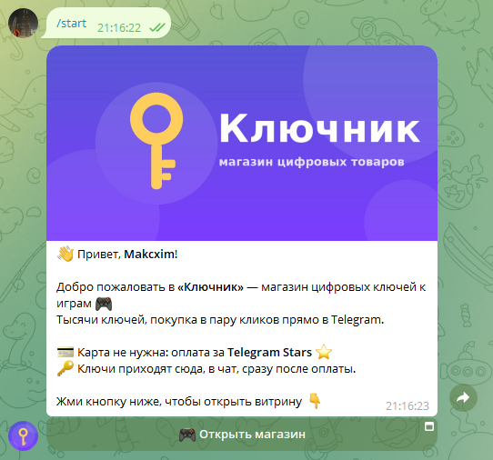
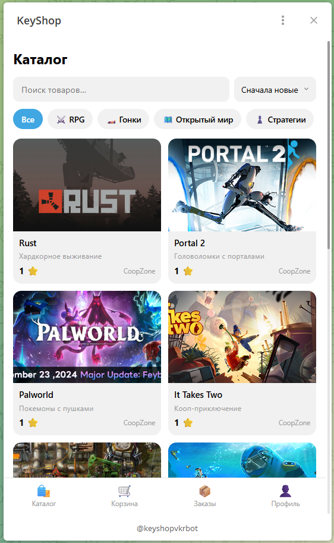
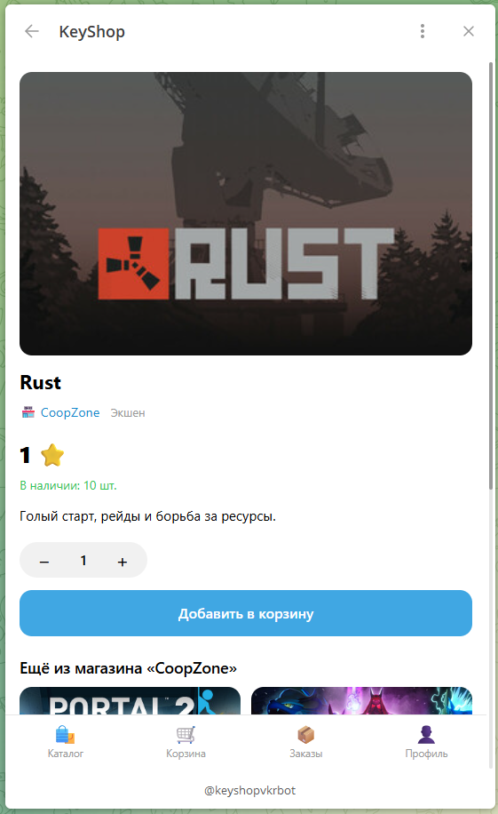
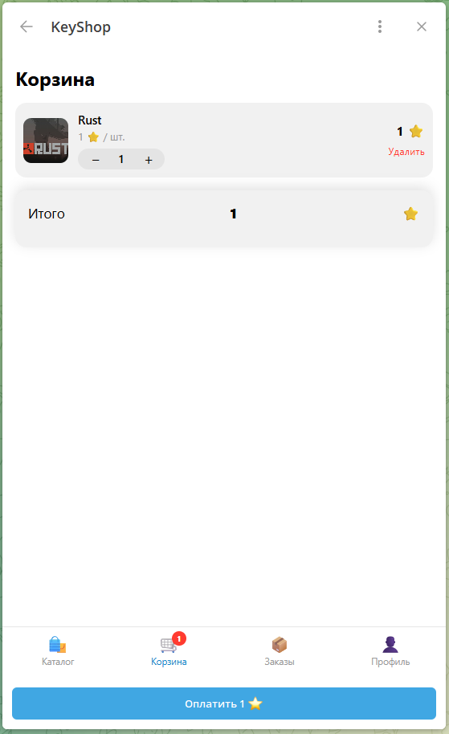
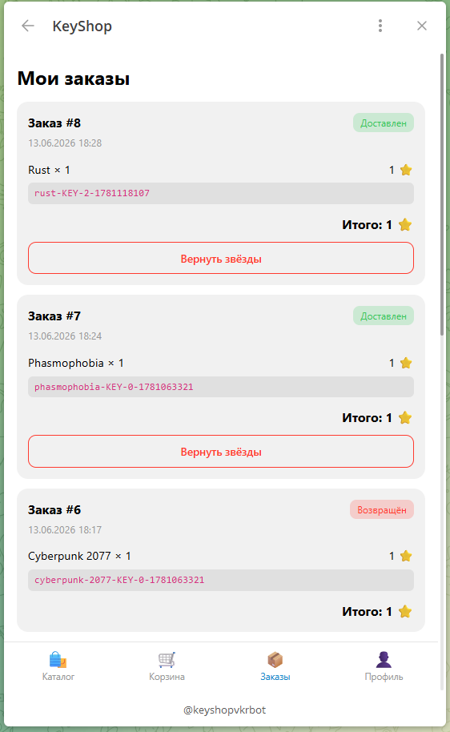
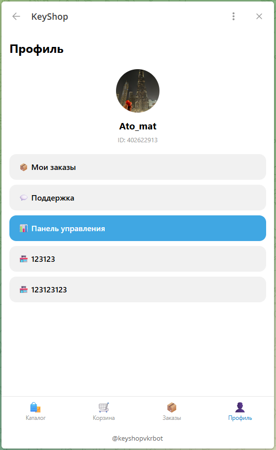
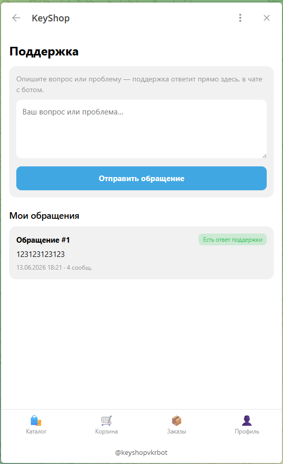
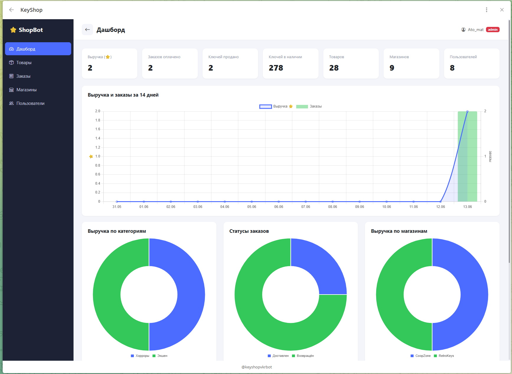
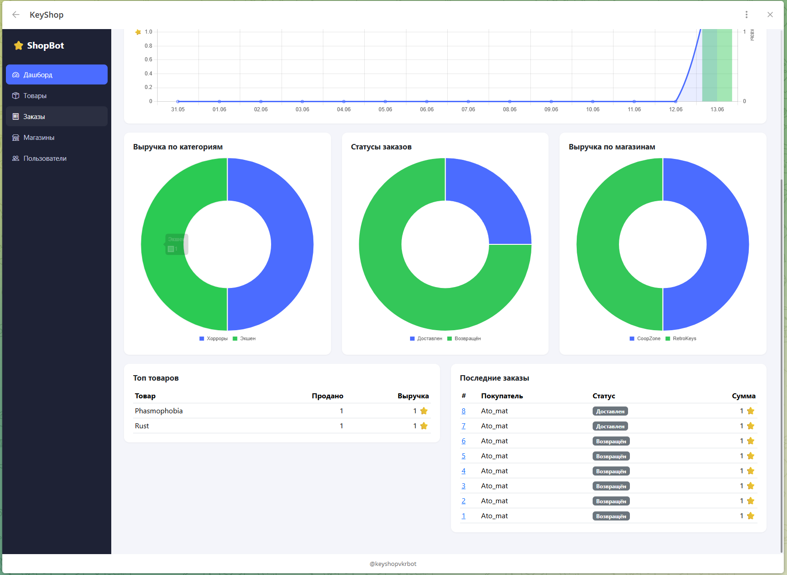
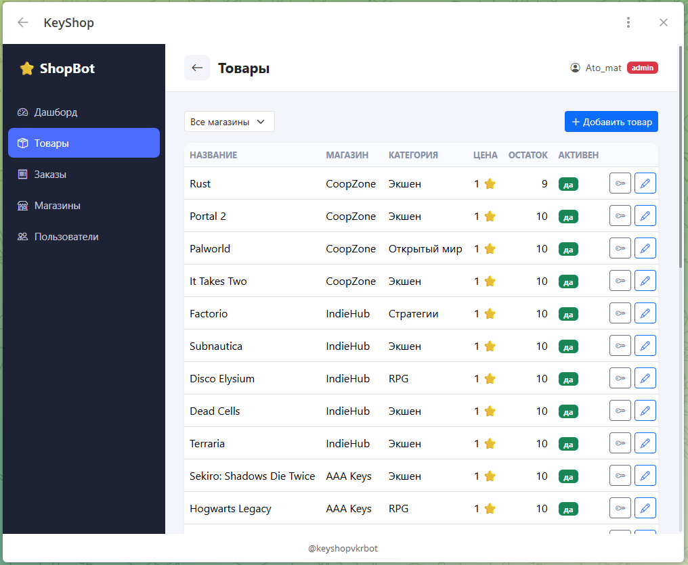
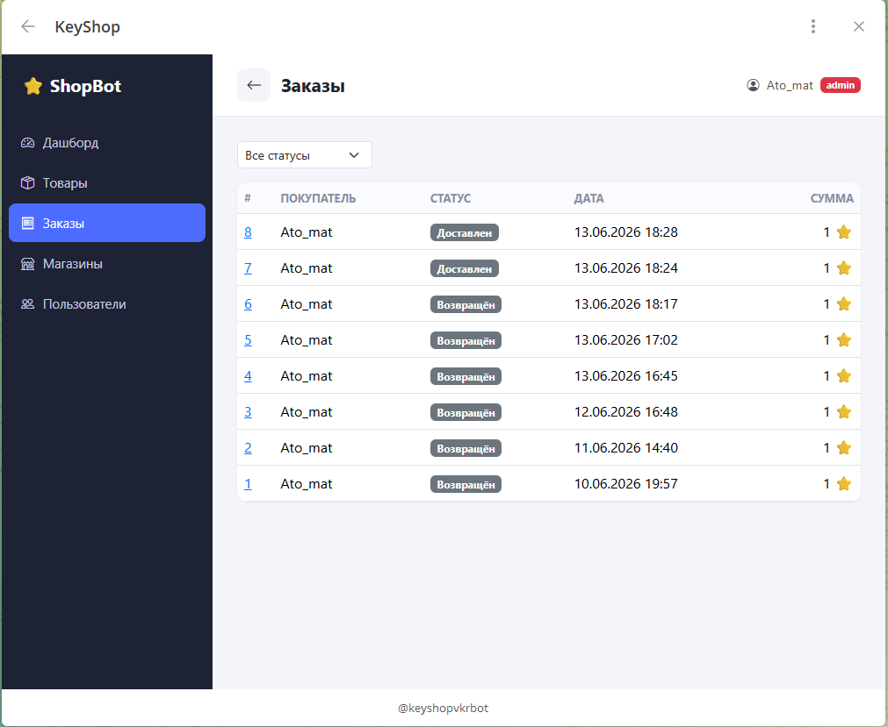
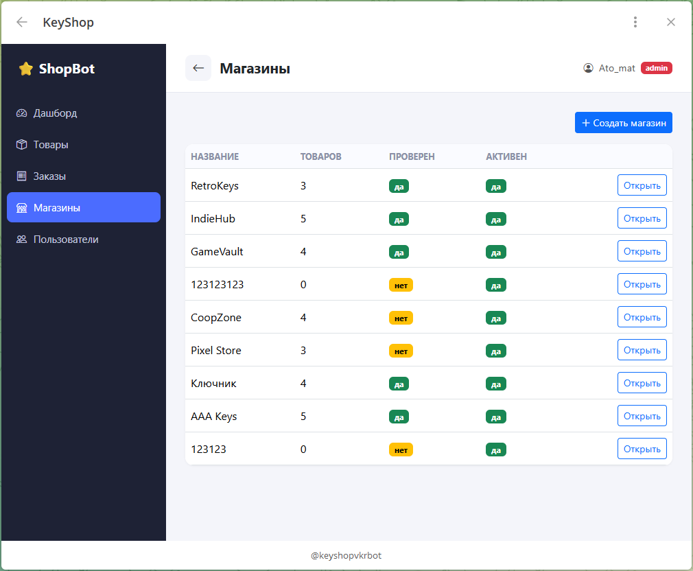
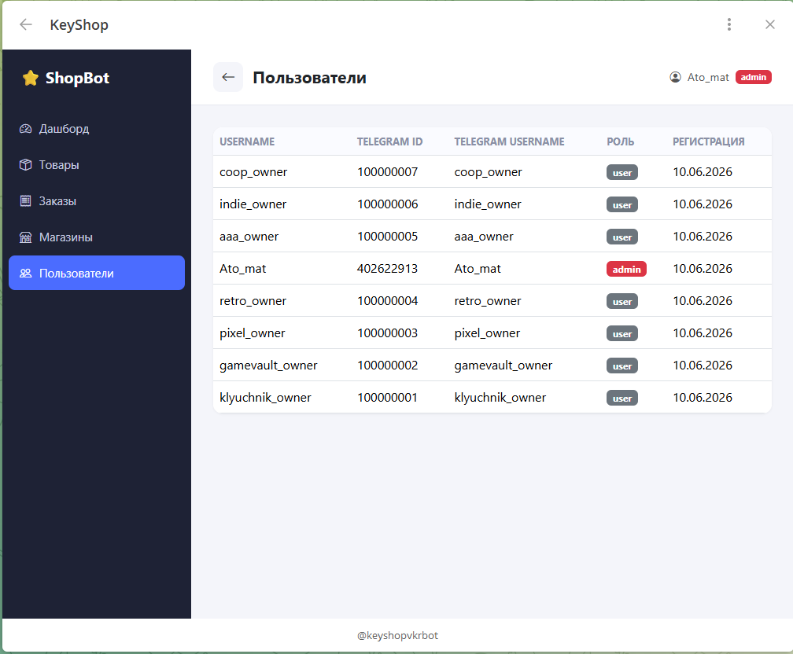


## Благодарности

- https://github.com/telegram-bot-php/durger-king
- https://github.com/fruitourist/liot/tree/main
