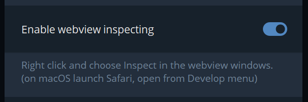
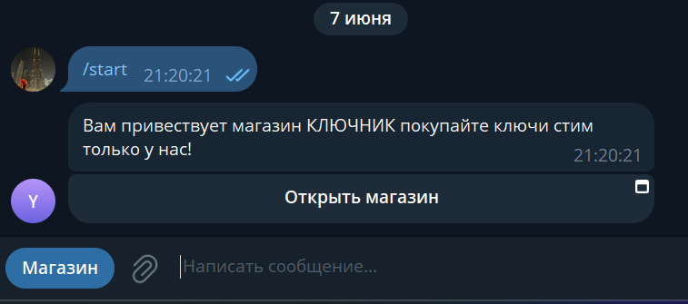
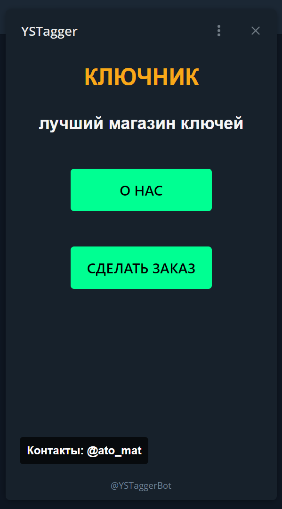
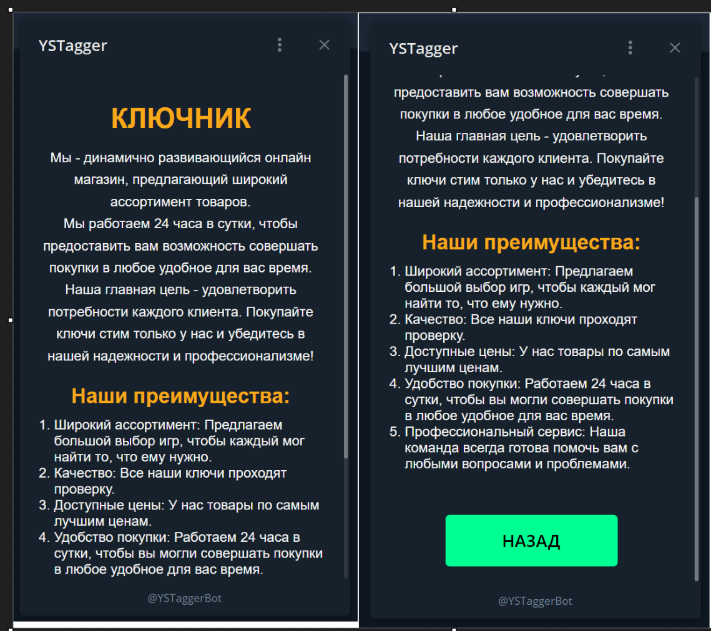
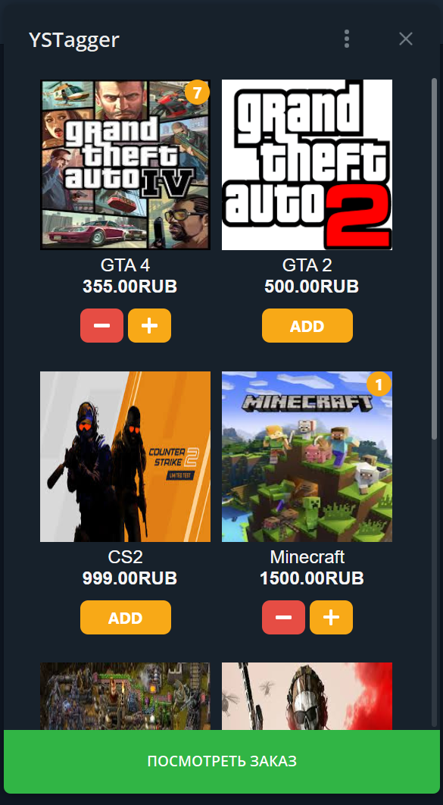
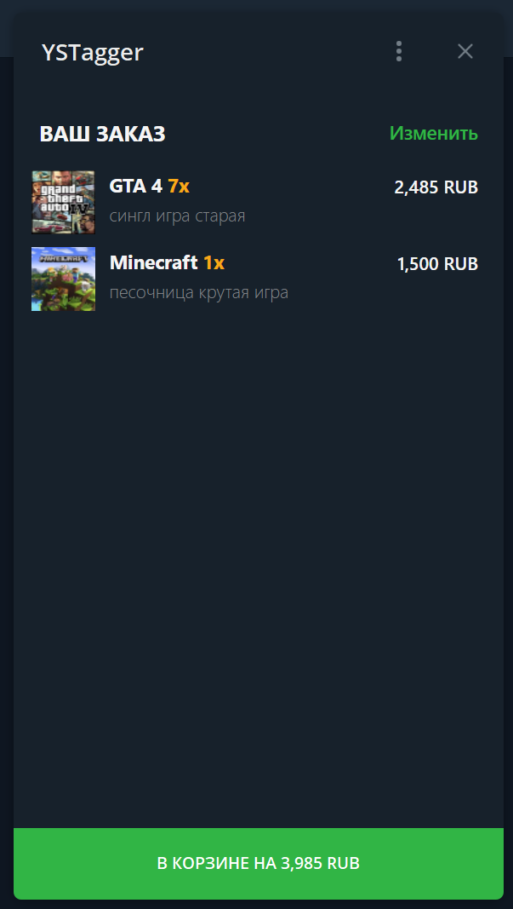
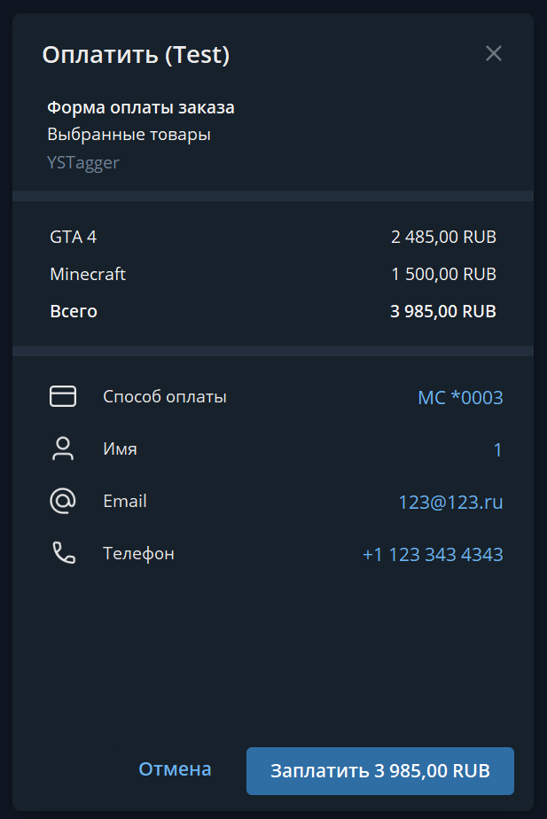
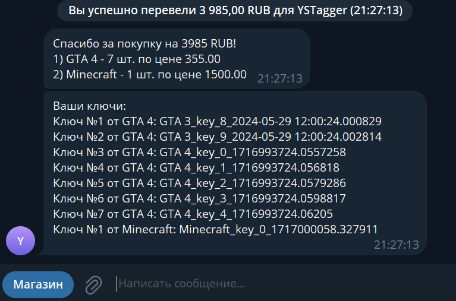

## Shopbot

Django проект, цель которого - создать Telegram бота с webapp приложением.  
Суть приложения - покупка чего-либо из приложения Telegram внутри webapp.  


## Webapp
Webapp - он же mini apps - они же приложения в Telegram  
По факту webapp - открытие сайта внутри тг с фишками тг  


## Легенда
Существует оффлайн магазин "Ключник", который торгует Steam ключами от игр.  
Магазин решил создать приложение внутри телеграма, чтобы пользователю не нужно было переходить на его сайт.  


## Запуск

Общее для обоих вариантов:
- Создать файл `.env` в папке `shopbot/` и заполнить по образцу `.env.example`
    - необязательно указывать `DEBUG`, `MAIN_PAGE_URL`, `TELEGRAM_API_URL`, `DJANGO_SECRET_KEY`
    - `DB_HOST` должен быть `db` (имя сервиса в docker-compose)

Сервисы docker-compose:
- `db` — PostgreSQL
- `web` — Django, слушает `127.0.0.1:9000` на хосте
- `bot` — Telegram-бот (polling)


### Локальное тестирование

Telegram WebApp требует HTTPS, поэтому локально поднимаем стек в Docker, а HTTPS
получаем через SSH-туннель до VPS (там nginx + сертификат уже настроены).

1) Запустить:
```bash
docker compose up -d --build
```
2) Применить миграции и создать суперпользователя:
```bash
docker compose exec web python manage.py migrate
docker compose exec web python manage.py createsuperuser
```
3) Прокинуть локальный `web` на VPS через обратный SSH-туннель:
```bash
ssh -R 9000:127.0.0.1:9000 user@your_domain
```
4) Открыть бота — WebApp будет ходить на домен VPS, а запросы попадут в локальный контейнер


### Продакшн

В проде используется `docker-compose.prod.yml` (gunicorn, `DJANGO_ENV=production`,
без bind-mount кода). В `.env` обязательно задать `ALLOWED_HOSTS` и `CSRF_TRUSTED_ORIGINS`.

1) Получить HTTPS-сертификат на сервер: [certbot](https://certbot.eff.org)
2) Запустить:
```bash
docker compose -f docker-compose.prod.yml up -d --build
docker compose -f docker-compose.prod.yml exec web python manage.py createsuperuser
```
(миграции и `collectstatic` выполняются автоматически при старте сервиса `web`)

3) Настроить хостовой nginx — проксирует на `web` (`127.0.0.1:9000`), раздаёт static/media, заменить `YOUR_DOMAIN`:
```nginx
server {
    listen 443 ssl;
    listen [::]:443 ssl;
    server_name YOUR_DOMAIN www.YOUR_DOMAIN;

    ssl_certificate     /etc/letsencrypt/live/YOUR_DOMAIN/fullchain.pem;
    ssl_certificate_key /etc/letsencrypt/live/YOUR_DOMAIN/privkey.pem;
    include             /etc/letsencrypt/options-ssl-nginx.conf;
    ssl_dhparam         /etc/letsencrypt/ssl-dhparams.pem;

    location /static/ { alias /path/to/ShopBot/shopbot/static/; }
    location /media/  { alias /path/to/ShopBot/shopbot/media/; }

    location / {
        proxy_pass         http://127.0.0.1:9000;
        proxy_set_header   Host              $http_host;
        proxy_set_header   X-Real-IP         $remote_addr;
        proxy_set_header   X-Forwarded-For   $proxy_add_x_forwarded_for;
        proxy_set_header   X-Forwarded-Proto $scheme;
        proxy_set_header   X-Forwarded-Host  $host;
        proxy_set_header   X-Forwarded-Server $host;
    }
}

server {
    listen 80;
    listen [::]:80;
    server_name YOUR_DOMAIN www.YOUR_DOMAIN;
    return 301 https://$host$request_uri;
}
```


## Структура


### Django проект:
- приложение shopbot - основное приложение с настройками для django проекта
- приложение bot - приложение для работы с telegram ботом
- приложение webapp - приложение для работы с webapp


### Приложение bot:
- содержит команду start_telegram_bot, которая запускает telegram бота
- файл telegram_bot, в котором находятся все хендлеры бота
- файл views, в котором находится django view для создания ссылки оплаты


### Приложение webapp: 
- команда generate_product_keys - генерация 10 ключей для всех игр 
- команда update_remain_keys - обновление остатка ключей для игр
- статику и шаблон (html, js, css) для webapp 
- модели:
    - ShopProduct - сама игра с ее описанием
    - ShopProductKey - ключи ко всем играм
    - ShopOrder - успешные сделки с пользователями


## Важное

Чтобы видеть какие то игры в разделе "Сделать заказ"  
нужно вручную добавить сами игры в модель django  
для этого нужно зайти по ссылке `https://{your_website}/admin`  
перейти в модель ShopProduct и добавить полей с играми

команда `python manage.py seed_test_data`   
создаст тестовые данные

команда `python manage.py generate_product_keys`   
добавит к каждой игре по 10 ключей для тестов


команда `python manage.py update_remain_keys`   
автоматически обновит поля оставшихся ключей в модели игр

команда `python manage.py start_telegram_bot`   
запустит телеграм бота (в Docker это делает сервис `bot` автоматически)


## Интересное

Для дебага вашего webapp можно включить настройку в телеграме
Будет открываться devtools как в браузере по пкм 
Очень полезна при разработке 




## Картиночки 














## TODO

- [x] docker
- [ ] optimize js code
- [ ] improve layout

## THX

https://github.com/telegram-bot-php/durger-king    
https://github.com/fruitourist/liot/tree/main   
